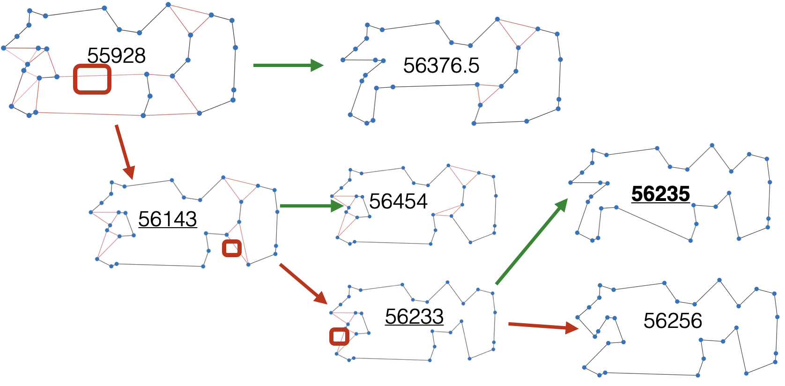
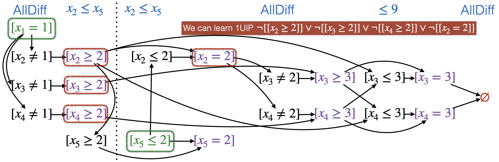

> This is a backup of the old "How does it work?" section.

## How does it work?

| :warning: This part is under construction and will be rewritten in large parts as soon as I have the time.

Let us now take a look on what is actually happening under the hood.
You may have already learned that CP-SAT is transforming the problem into a SAT-formula.
This is of course not just an application of
the [Cook-Levin Theorem](https://en.wikipedia.org/wiki/Cook%E2%80%93Levin_theorem) and also not just creating a boolean
variable for every possible integer assignment combined with many, many constraints.
No, it is actually kind of a simulation of Branch and Bound on a SAT-solver (gifting us clause learning and stuff) with
a lot (!) of lazy variables and clauses (LCG).
Additionally, tools from classical linear optimization (linear relaxations, RINS, ...) are applied when useful to guide
the process (it is not like everything is done by the SAT-solver, but every thread uses a different strategy).

Before we dig any deeper, let us first get some prerequisites, so we are on the same page.
Remember, that this tutorial is written from the view of linear optimization.

### Prerequisites

CP-SAT actually builds upon quite a set of techniques. However, it is enough if you understand the basics of those.

| :warning: This is still in a very drafty state. There are also still some useful examples missing.

#### SAT-Solvers

Today's SAT-solvers have become quite powerful and are now able to frequently solve instances with millions of variables
and clauses.
The advent of performant SAT-solvers only came around 2000 and the improvements still have some momentum.
You can get a good overview of the history and developments of SAT-solvers in [this video](https://youtu.be/DU44Y9Pt504)
by Armin Biere.
Remember that SAT-formulas are usually stated in [CNF](https://en.wikipedia.org/wiki/Conjunctive_normal_form), i.e., a
conjunction of disjunctions of literals, e.g., 
$(x_1 \vee x_2 \vee x_3) \wedge (\overline{x_1} \vee \overline{x_2})\wedge (x_1 \vee \overline{x_3})$.
Any SAT-formula can be efficiently converted to such a representation.

If you want to actually dig deep into SAT-solvers, luckily there is literature for you, e.g.,
* *Donald Knuth - The Art of Computer Programming, Volume 4, Fascicle 6: Satisfiability*.
* The *Handbook of Satisfiability* may provide much more information, but is unfortunately pretty expensive.
* If you want some free material, I liked the slides
of [Carsten Sinz and Tomas Baylo - Practical SAT Solving](https://baldur.iti.kit.edu/sat/#about) quite a lot.

##### DPLL and Unit Propagation

The first important technique in solving SAT-formulas is
the [Davis–Putnam–Logemann–Loveland (DPLL) algorithm](https://en.wikipedia.org/wiki/DPLL_algorithm).
Modern SAT-solver are actually just this backtracking-based algorithm with extras.
The probably most important part to remember is the unit-propagation: If we have a clause 
$(x_1\vee x_2 \vee \overline{x_3})$ and we have already set $x_1=0$ and $x_3=1$, we know that $x_2=1$.
The important thing about unit propagation is that there are highly-efficient data structures (e.g., 2-watched literals)
that can notify us whenever this happens.
This is actually a point I missed for quite some time, so I emphasize it especially for you so you don't have the same
struggles as me: A lot of the further design decision are actually just to trigger unit propagation as often as
possible.
You may want to check out [these slides](https://baldur.iti.kit.edu/sat/files/2019/l05.pdf) for more information.

##### Conflict-driven clause learning (CDCL)

One very important idea in SAT-solving
is [learning new clauses](https://en.wikipedia.org/wiki/Conflict-driven_clause_learning), which allows us to identify
infeasibility earlier in the search tree.
We are not learning anything that is not available in the original formulas, but we learn better representations of this
information, which will help us not to repeat the same mistakes again and again.

Let us look on an overly simplified example:
Consider the formula
$(x_0\vee x_1)\wedge (x_2 \vee x_3)\wedge (\overline{x_0}\vee\overline{x_2})\wedge (\overline{x_1}\vee x_2\vee\overline{x_3})$.
Let us assign $x_0=0$, which results in $x_1=1$ by unit propagation.
If we now assign $x_2 = 0$, we have to assign $x_3=1$ by unit propagation, but this creates a conflict in 
$(\overline{x_1} \vee x_2 \vee \overline{x_3})$.
The core of this conflict was setting $x_0=x_2=0$, and therefore we can add the clause $(x_0 \vee x_2)$.
Actually, this specific clause is not very helpful.
In CDCL we usually extract a clause (1UIP) that will easily be triggered by the unit propagation in the next step.

For a better understanding, I recommend to take a look
at [these slides](https://baldur.iti.kit.edu/sat/files/2019/l07.pdf).

> For all the Branch and Bound-people: Clause learning can be considered as some kind of
> infeasibility pruning. Instead of having bounds that tell you, you don't have to go 
> deeper into this branch, you have get a number of conflict
> clauses
> that tell you, that nothing feasible can come out of branches that fit any of these clauses. There
> is [some work](https://www.csc.kth.se/~jakobn/research/LearnToRelax_Constraints.pdf) in also integrating this into
> branch and cut procedures, but it is not yet used in the state-of-the-art MIP-solvers, as far as I know. CP-SAT, on
> the
> other hand, does that (plus some rudimentary branch and cutting) which maybe explains why it is so much stronger for
> some problems, especially if they have a lot of logic.

#### Linear and Integer Programming

For this topic, there is actually a [nice primer by Gurobi](https://www.gurobi.com/resource/mip-basics/).
Let me quickly recap the most important parts for CP-SAT:

* Mixed Integer Linear Programming is a subset of CP-SAT, but one that is still very powerful and can be reasonably well
  solved. It limits you to linear constraints, but you can actually convert most of the other constraints to linear
  constraints.
* A mixed integer linear program is still hard to solve, but if we allow all integral values to become fractional it
  suddenly becomes a problem that we can solve efficiently. This is called a **linear relaxation**, potentially further
  improved by cutting planes. The linear relaxation provides us often with very good bounds (which is why Branch and Cut
  works so well for many problems). Also take a look on how close the linear relaxation of the TSP example below is
  already on the root node.
* Thanks to duality theory, we can even get bounds without solving the linear relaxation completely (for example if we
  just want to quickly estimate the influence of a potential branching decision).
* We can warm-start this process and slight modifications to an already solved model will only take a small extra amount
  of time to solve again.

Let us take a quick look at an example for the famous NP-hard Traveling Salesman Problem.
The idea is to solve the linear relaxation of the problem, which is a provable lower bound but maybe use edges only
fractionally (which is of course prohibited).
These fractional edges are highlighted in red in the image below.
However, this relaxation is efficiently solvable and reasonably close to a proper solution.
Next, we select a fractional edge and solve the problem once with this edge forced to one and once with this edge forced
to false.
This is called the branching step and it divides the solution space into two smaller once (cutting of all solutions
where this edge is used fractionally).
For the subproblems, we can again efficiently compute the linear relaxation.
By continuing this process on the leaf with the currently best lower bound, we end reasonably quickly by a provably
optimal solution (because all other leaves have a worse objective).
Note that for this instance with 30 points, there exists over $10^{30}$ solutions which is out of reach of any computer.
Still we managed to compute the optimal solution in just a few steps.

This example has been generated with [this tool by Bill Cook](http://www.math.uwaterloo.ca/tsp/D3/bootQ.html#).
Let me again recommend the
book [In Pursuit of the Traveling Salesman by Bill Cook](https://press.princeton.edu/books/paperback/9780691163529/in-pursuit-of-the-traveling-salesman)
, which actually covers all the fundamentals of linear and integer programming you need in an easily digestible way even
suited for beginners.

> **Even if SAT is the backbone of CP-SAT, linear programming techniques are used and still play a fundamental role,
especially the linear relaxation. Also see [this talk](https://youtu.be/lmy1ddn4cyw?t=1355) by the developers.
Using `model.parameters.linearization_level` you can also specify, how much of the model should be linearized. The
importance of the LP for CP-SAT also shows in some benchmarks: Without it, only 130 problems of the MIPLIB 2017 could be
solved to optimality, with LP 244, and with portfolio parallelization even 327.**

### Lazy Clause Generation Constraint Programming

The basic idea in lazy clause generation constraint programming is to convert the problem into a (lazy) SAT-formula, and
have an additional set of propagators that dynamically add clauses to satisfy the complex constraints.

> We will quickly go through how we can encode an optimization problem into a SAT-formula here, but you may want to read an 
> [explanation by Peter Stuckey](https://people.eng.unimelb.edu.au/pstuckey/papers/lazy.pdf) himself. At this point, you
> should have covered the basics to actually understand it. My explanation can probably not compete with his, since he
> is one of the leading researchers in this field, and I am primarily a user of this technique.

#### Encoding

Let $x$ be a variable and $D(x)$ its domain, i.e., a set of the values it can take.
In the beginning $D(x)$ will be defined by the lower and upper bound.

CP-SAT uses an order and value encoding. Thus, we have the following variables:

$$[x\leq v] \quad \forall v\in D(x)$$
$$[x=v] \quad \forall v\in D(x)$$

The inverse variables can be obtained by negation

$$[x\geq v] \equiv \neg [x\leq v-1]$$
$$[x\not=v] \equiv \neg [x=v]$$

and the following constraints that enforce consistency:

$$[x\leq v] \Rightarrow [x\leq v+1]$$
$$[x=v] \Leftrightarrow [x\leq v] \wedge [x\geq v]$$

This is linear in the size of the domain for each variable, and thus still prohibitively large.
However, we probably will only need a few values for each variables.
If only the values x=1, 7 or 20 are interesting, we could simply just create variables for those and the constraints
$[x\leq 1] \Rightarrow [x\leq 7], [x\leq 7 \Rightarrow x\leq 20], \ldots$.
When it turns out that we need more, we simply extend the model lazily.

There are a few things to talk about:

1. Why do we need the order variables $[x\leq v]$? Because otherwise we would need a quadratic amount of consistency
   constraints ( $[x=v] \rightarrow [x\not= v'] ~ \forall v\not=v' \in D(x)$ ).
2. Why use a unary encoding instead of a logarithmic? Because it propagates much better with unit propagation. E.g., if
   $[x\leq v]$ is set, all $[x\leq v'], v'>v$ are automatically triggered. This is much harder, if not impossible, to
   achieve if each value consist of multiple variables. Thanks to the lazy variable generation, we often still need only
   few explicit values.

#### Propagator

So, we have consistent integral variables in a SAT-formula, but how do we add numerical constraints as boolean logic?

Let us take a look on the simple constraint $x=y+z$.
This constraint can also be expressed as $y=x-z$ and $z=x-y$.
We can propagate the domains of the variables onto each other, especially if we fixed the value of one during search,
e.g., $D(x)={0, 1, \ldots, 100} \rightarrow D(x)=\{5\}$.

$$ x \geq \min(D(y))+\min(D(z)) \quad x \leq \max(D(y))+\max(D(z)) $$

$$ y \geq \min(D(x))-\max(D(z)) \quad y \leq \max(D(x))-\min(D(z)) $$

$$ z \geq \min(D(x))-\max(D(y)) \quad z \leq \max(D(x))-\min(D(y)) $$

Other constraints will be more complex, but you see the general idea.

In this context, the technique of [SMT solvers](https://en.wikipedia.org/wiki/Satisfiability_modulo_theories) can also
be interesting.

#### Branching/Searching

Whenever we can no longer propagate anything, i.e., reached a fixpoint, we have to branch on some variable.
Branching can be interpreted as fixing a variable, e.g., $[x\leq 7]=1$.
This is actually just DPLL.

For finding an optional solution, we just have to find a feasible solution with $[obj\leq T]=1$ is satisfiable and
$[obj\leq T-1]$ is unsatisfiable (for a minimization problem).

An example for LCG can be seen below.
This example is taken from a [talk of Peter Stuckey](https://youtu.be/lxiCHRFNgno?t=642) (link directly guides you to
the right position in the video, if you want this example explained to you) and shows a search process that leads to
conflict and a newly learned clause to prevent this conflict earlier in other branches.
The green literals show search decisions/branches (talking about branches is slightly odd because of the way SAT-solver
search: they usually have only a single path of the tree in memory).
The purple literals are triggered by the numeric consistency rules.
The columns with the blue headlines show the application of propagators (i.e., clause generation) for the three
constraints.
The arrows pointing towards a node can be seen as conjunctive implication clauses ( $x\wedge y \Rightarrow z$ ),
that are added lazily by the propagators.

$$x_1,x_2,x_3,x_4,x_5 \in \{1,2,3,4,5\}$$

$$\mathtt{AllDifferent}(x_1,x_2,x_3,x_4)$$

$$x_2\leq x_5$$

$$x_1+x_2+x_3+x_4\leq 9$$

Note that the 1UIP is pretty great: independent of the $[[x_5\leq 2]]$ decision,
the new clause will directly trigger and set $\neg [[x_2=2]]$
(in addition to $\neg [[x_5\leq 2]]$ by search).

### What happens in CP-SAT on solve?

So, what actually happens when you execute `solver.Solve(model)`?

1. The model is read.
2. The model is verified.
3. Preprocessing (multiple iterations):

   a. Presolve (domain reduction)

   b. Expanding higher-level constraints to lower-level constraints. See also the
   analogous [FlatZinc and Flattening](https://www.minizinc.org/doc-2.5.5/en/flattening.html).

   c. Detection of equivalent variables
   and [affine relations](https://personal.math.ubc.ca/~cass/courses/m309-03a/a1/olafson/affine_fuctions.htm).

   d. Substitute these by canonical representations

   e. Probe some variables to detect if they are actually fixed or detect further equivalences.
4. Load the preprocessed model into the underlying SAT-solver and create the linear relaxation.
5. **Search for an optimal solution using the SAT-model (LCG) and the linear relaxation.**
6. Transform solution back to original model.

This is taken from [this talk](https://youtu.be/lmy1ddn4cyw?t=434) and slightly extended.

#### The use of linear programming techniques

As already mentioned before, CP-SAT also utilizes the (dual) simplex algorithm and linear relaxations.
The linear relaxation is implemented as a propagator and potentially executed at every node in the search tree
but only at lowest priority. A significant difference to the application of linear relaxations in branch and bound
algorithms is that only some pivot iterations are performed (to make it faster). However, as there are likely
much deeper search trees and the warm-starts are utilized, the optimal linear relaxation may still be computed, just
deeper down the tree (note that for SAT-solving, the search tree is usually traversed DFS). At root level, even
cutting planes such as Gomory-Cuts are applied to improve the linear relaxation.

The linear relaxation is used for detecting infeasibility (IPs can actually be more powerful than simple SAT, at least
in theory), finding better bounds for the objective and variables, and also for making branching decisions (using the
linear relaxation's objective and the reduced costs).

The used Relaxation Induced Neighborhood Search RINS (LNS worker), a very successful heuristic, of course also uses
linear programming.
